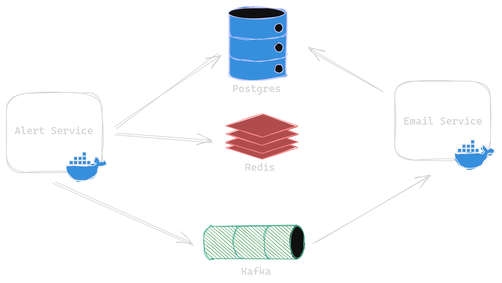
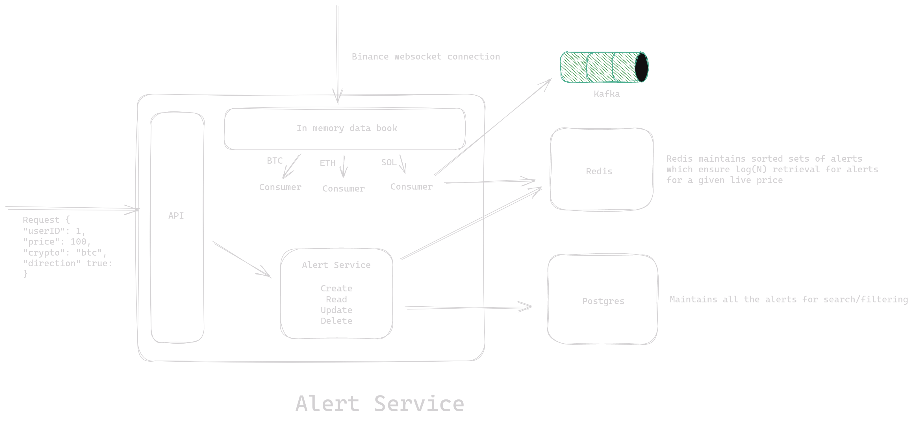
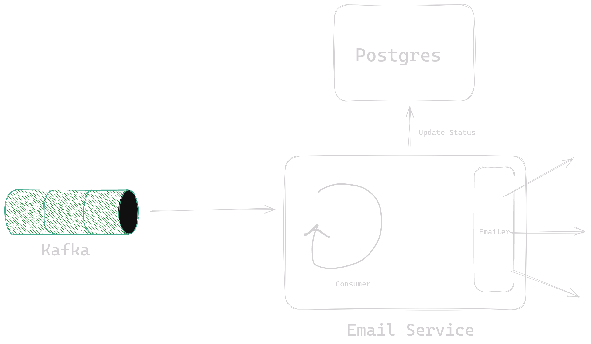
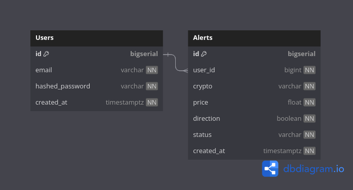
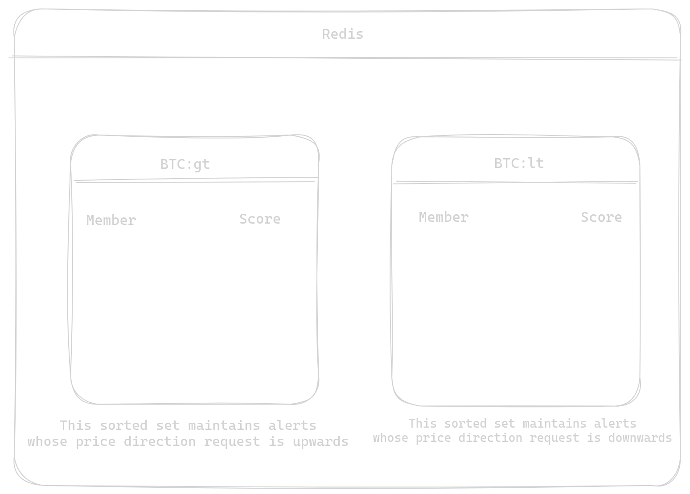

- [Crypto Alert System](#crypto-alert-system)
  - [Setup](#setup)
  - [System design](#system-design)
    - [High level](#high-level)
    - [Low level](#low-level)
  - [Database Design](#database-design)
    - [Postgres](#postgres)
    - [Redis](#redis)
- [Todos](#todos)

# Crypto Alert System
- A complete system to create alerts for crypto currency prices.
- `No frameworks` are used. Everything is architected in `Go` using hex architecture and DDD design principles.
- Follow the setup instructions to run the project.
- Then after creating a demo alert, don't forget to check your spam email for the alert notification :) 

## Setup

1. Install docker and docker-compose on your system by following official docs

2. Clone the repo
```sh
git clone https://github.com/Mayhul-Jindal/crypto-alert
```

3. Run docker-compose up
```sh
docker-compose up
```

4. Use this postman instance to play with the API
```
https://www.postman.com/mission-physicist-26981670/workspace/crypto-alert-system/request/19360543-0bcd8c0d-640c-431f-bd15-fd70bd1fcc8d?tab=headers
```

## System design

### High level


### Low level

- Alert Service


- Email Service


## Database Design

### Postgres


### Redis



# Todos
- [X] Create a rest API endpoint for the user’s to create an alert `alerts/create/`
- [X] Create a rest API endpoint for the user’s to delete an alert `alerts/delete/`
- [X] Create a rest API endpoint to `fetch all the alerts` that the user has created.
- [X] The response should also include the `status of the alerts` (created, triggered, completed, deleted)
- [X] `Paginate` the response.
- [X] Include `filter` options based on the status of the alerts
- [X] binance’s `websocket` connection to get real time price updates
- [X] When the price of the coin reaches the price specified by the users, send an email to the user that the target price has been hit `smtp`
- [X] Add a caching layer `redis`
- [X] Add user authentication to the endpoints. Use `JWT` tokens.
- [X] Go
- [X] Use `Postgres` to store data and  `redis` for sorted sets (or any DB you feel that gets the job done)
- [X] `Kafka` as a message broker for the task to send emails /print the output
- [X] Bundle everything inside a docker-compose file so it’s easier for us to test.
- [X] Document your solution in README.md file. Consider adding the following details
- [X] Steps to run the project (eg: docker-compose up)
- [X] Document the endpoints
- [X] Document the solution for sending alerts
